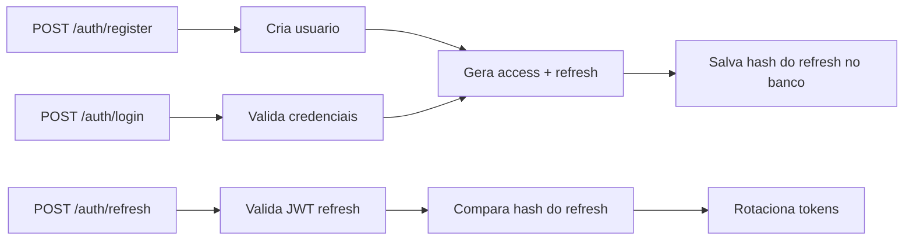

# App Service Work - Visao Geral Tecnica

## Proposito
API de autenticacao com NestJS, projetada para ser simples no inicio e pronta para evolucao.

## O que ja existe
- Registro de usuario
- Login com emissao de access token e refresh token
- Renovacao de tokens por refresh
- Persistencia com TypeORM
- Banco em memoria por padrao (SQLite :memory:)
- Migration inicial para tabela de usuarios

## Princípios de arquitetura
- Separacao em camadas por responsabilidade:
  - presentation: controller e contrato HTTP
  - application: regras de negocio
  - domain: entidades
  - database: config e migrations
- Codigo orientado a evolucao para troca de banco sem reescrever modulo de auth

## Mapa rapido de pastas
```text
src/
  database/
    data-source.ts
    typeorm.config.ts
    migrations/
  modules/
    auth/
      presentation/
      application/
      domain/
```

## Fluxo de autenticacao


## Ambientes
- Desenvolvimento local: SQLite em memoria
- Futuro: Postgres por variavel de ambiente

Veja detalhes da API em [01-guia-api.md](01-guia-api.md).
Veja banco e migrations em [02-arquitetura-banco.md](02-arquitetura-banco.md).
