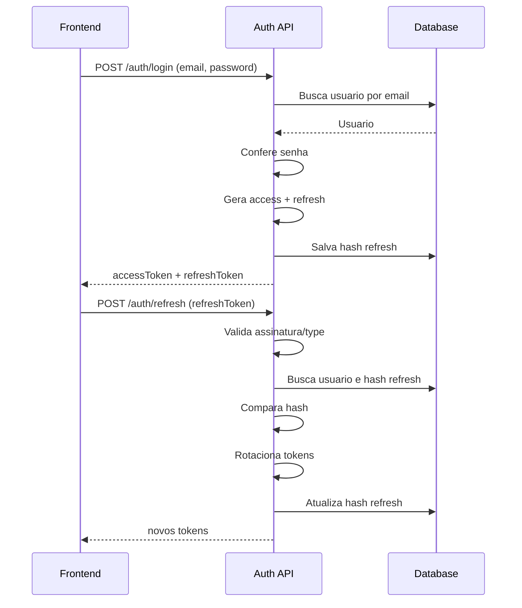

# Guia de API - Auth

## Base URL
- Local: `http://localhost:3000`

## Convencoes
- Content-Type: `application/json`
- Tokens retornam no corpo, nao em cookie
- `tokenType` sempre sera `Bearer`

## Modelo de resposta de sucesso
```json
{
  "accessToken": "string",
  "refreshToken": "string",
  "tokenType": "Bearer"
}
```

## Modelo de erro (Nest padrao)
```json
{
  "statusCode": 401,
  "message": "Invalid credentials",
  "error": "Unauthorized"
}
```

## Endpoint 1 - Registrar usuario
### Request
- Metodo: `POST`
- Rota: `/auth/register`

```json
{
  "email": "user@example.com",
  "password": "123456"
}
```

### Validacoes
- `email`: email valido, max 120
- `password`: string, min 6, max 72

### Responses
- `201 Created`: usuario criado e tokens emitidos
- `400 Bad Request`: email ja cadastrado ou payload invalido

### Exemplo curl
```bash
curl -X POST http://localhost:3000/auth/register \
  -H "Content-Type: application/json" \
  -d '{"email":"user@example.com","password":"123456"}'
```

## Endpoint 2 - Login
### Request
- Metodo: `POST`
- Rota: `/auth/login`

```json
{
  "email": "user@example.com",
  "password": "123456"
}
```

### Responses
- `201 Created`: credenciais validas e tokens emitidos
- `401 Unauthorized`: credenciais invalidas
- `400 Bad Request`: payload invalido

### Exemplo curl
```bash
curl -X POST http://localhost:3000/auth/login \
  -H "Content-Type: application/json" \
  -d '{"email":"user@example.com","password":"123456"}'
```

## Endpoint 3 - Refresh token
### Request
- Metodo: `POST`
- Rota: `/auth/refresh`

```json
{
  "refreshToken": "<jwt-refresh-token>"
}
```

### Logica
- Valida assinatura do JWT refresh
- Valida tipo do token (`type = refresh`)
- Compara hash no banco
- Se valido, rotaciona tokens (gera novos access e refresh)

### Responses
- `201 Created`: refresh aceito, tokens renovados
- `401 Unauthorized`: refresh invalido/expirado/nao correspondente
- `400 Bad Request`: payload invalido

### Exemplo curl
```bash
curl -X POST http://localhost:3000/auth/refresh \
  -H "Content-Type: application/json" \
  -d '{"refreshToken":"<jwt-refresh-token>"}'
```

## Diagrama de sequencia


## Guia rapido para frontend
### Estrategia de sessao
- Guarde `accessToken` em memoria (state)
- Guarde `refreshToken` em storage mais protegido possivel no contexto do app
- Ao receber `401` em endpoint protegido, tente refresh uma vez
- Se refresh falhar, deslogar usuario

### Exemplo em JavaScript (fetch)
```javascript
const API_BASE = 'http://localhost:3000';

export async function login(email, password) {
  const response = await fetch(`${API_BASE}/auth/login`, {
    method: 'POST',
    headers: { 'Content-Type': 'application/json' },
    body: JSON.stringify({ email, password }),
  });

  if (!response.ok) throw await response.json();
  return response.json();
}

export async function refresh(refreshToken) {
  const response = await fetch(`${API_BASE}/auth/refresh`, {
    method: 'POST',
    headers: { 'Content-Type': 'application/json' },
    body: JSON.stringify({ refreshToken }),
  });

  if (!response.ok) throw await response.json();
  return response.json();
}
```
