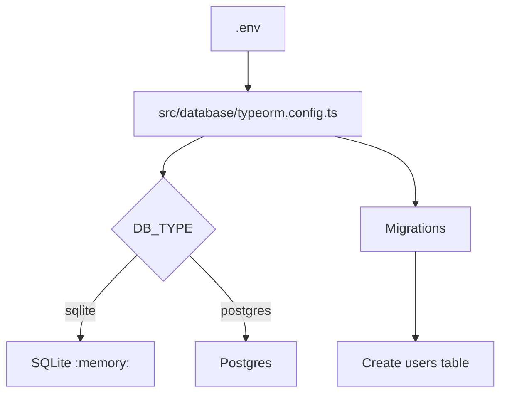

# Arquitetura de Banco e Migrations

## Banco atual
- Tipo padrao: SQLite em memoria
- Valor padrao: `DB_TYPE=sqlite` e `DB_DATABASE=:memory:`

## Por que em memoria agora
- Setup simples e rapido
- Bom para inicio e testes
- Sem dependencia externa

## Entidade principal
Tabela `users`:
- `id` (PK)
- `email` (unico)
- `password_hash`
- `refresh_token_hash` (nullable)
- `created_at`
- `updated_at`

## Migration inicial
Arquivo:
- `src/database/migrations/1710000000000-create-users-table.ts`

Ao iniciar a app, migrations sao executadas automaticamente pela config atual (`migrationsRun: true`).

## Scripts disponiveis
```bash
npm run migration:run
npm run migration:revert
```

## Como migrar para Postgres
1. Ajustar `.env`:
```env
DB_TYPE=postgres
DB_HOST=localhost
DB_PORT=5432
DB_USERNAME=postgres
DB_PASSWORD=postgres
DB_DATABASE=app_service_work
```
2. Subir a aplicacao
3. Rodar migrations se necessario

## Observacoes de seguranca
- Nunca versionar `.env`
- Alterar segredos JWT em producao
- Nao armazenar refresh token em texto plano (ja protegido com hash)

## Diagrama de configuracao

